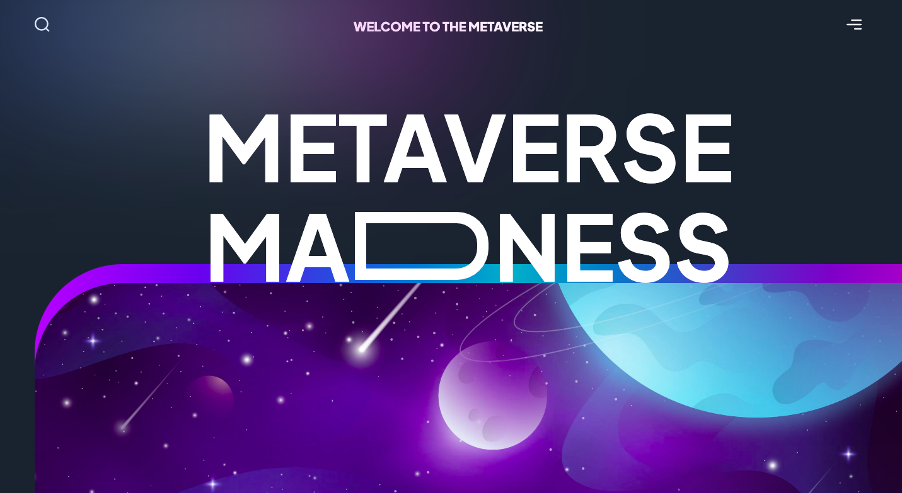
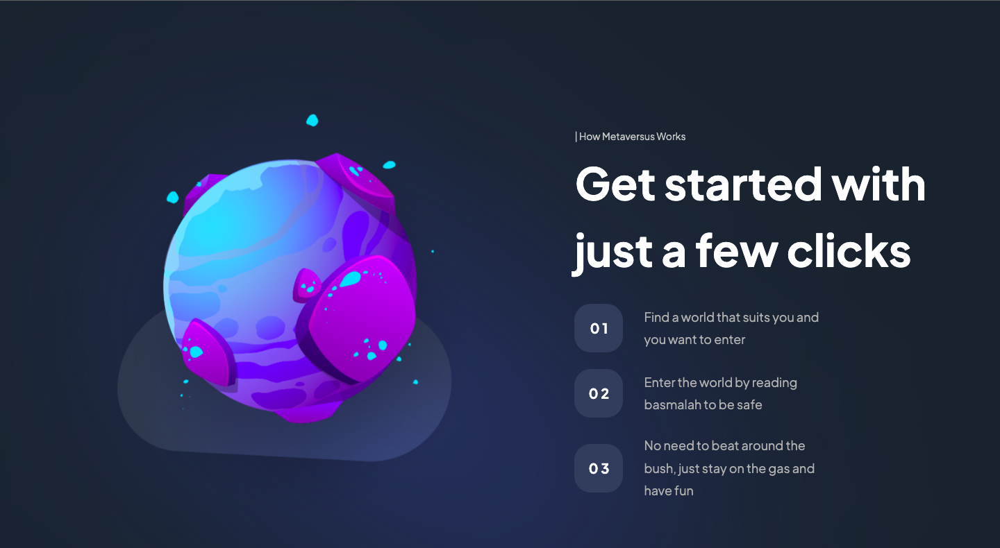

# A highly responsive landing page that uses framer motion to add animation to elements
# This project was made using NEXT 13 and framer motion
# you can clone the repo and run the following commands to get started
# npm install
# npm run dev
# leave a like for the repo if you like it

  
  
  
 

